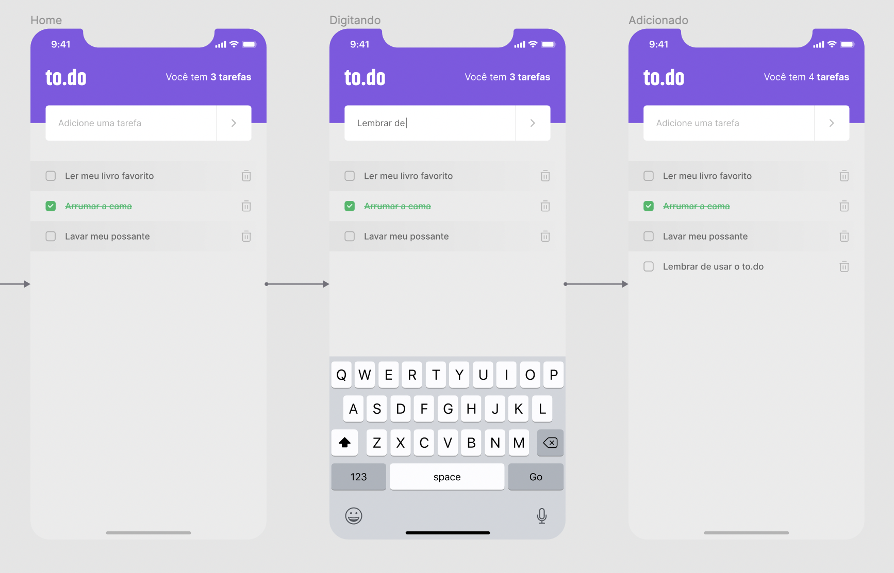

  <h1>✅ To.do - Seu aplicativo de afazeres</h1>
  
 > 📱 Aplicativo do desafio sobre conceitos básicos do React Native que serviu para mensurar os conhecimentos aprendidos até o momento na trilha de React Native no Ignite
    
  
   

    
  

 
  

## 🔨 Aprendizado

- [x] Estados com React Native
- [x] Importância da imutabilidade
- [x] Resolução de problemas em aplicações React native

## ✍ Tecnologias

- [x] React Native
- [x] Typescript

## ☕ Contatos

Você vai me encontrar em qualquer uma das redes sociais abaixo:

